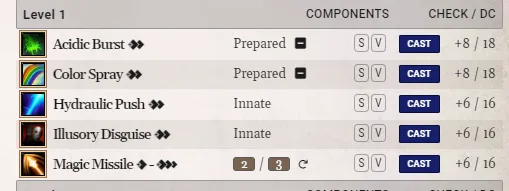

# FoundryVTT PF2e Spells Summary

This module offers the ability to toggle between the regular and an alternate version of the character sheet's `Spellcasting` tab at any moment.

To toggle between both modes, you simply need to click on the spellcasting nav button  at the top of the sheet.

The alternate version gather, sort and display all the available spells into a single table per level regardless of their category or casting type.

New informations are displayed to make up for the lack of category grouping: `DC`, `Check` and type `Innate`, `Prepared`, `Spontaneous` or `Focus`. The spellcasting entry name is also displayed when hovering over the `Check/DC` values.

When hovering over a spell, the resources used by the spell will also be dislayed and can be interacted with as shown in the image below.

_Resources of a spontaneous `Magic Missile` displayed on hover_

The alternate mode does not allow to create, edit or delete the spells, nor does it allow to change the spells selected from a spellbook. It is there to make it easier to see what is available during playtime.

# PF2e Staves

This module is compatible with the module [PF2e Staves](https://foundryvtt.com/packages/pf2e-staves)

# Settings

## Sort By Types

When enabled, the spells inside a level table will be sorted by types (prepared, innate, etc.) before alphabetically.

# CHANGELOG

You can see the changelog [HERE](./CHANGELOG.md)
